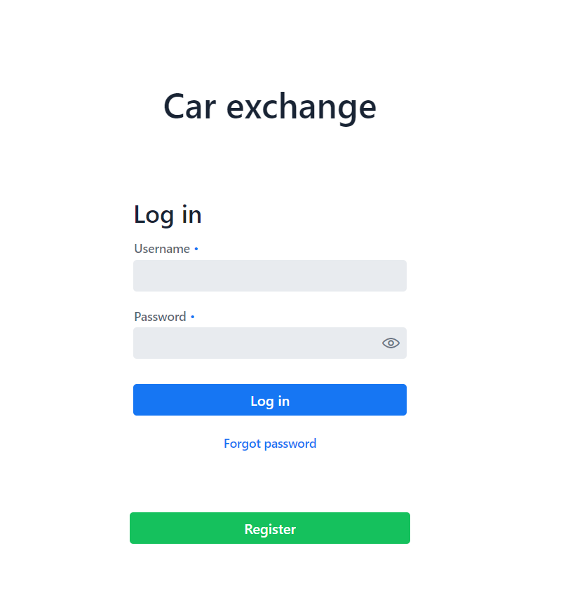
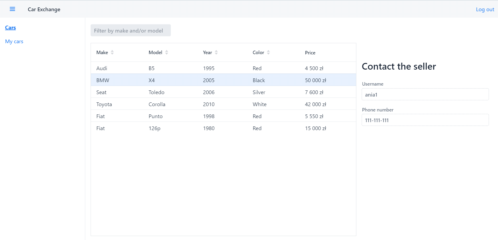

# car-exchange
It's a web application for car exchanging. While programming I learned how to use Spring and Vaadin to create an secured app that uses database and provide responsive GUI.  

**Functionality:** 
- Registration 
- Login
- Add/delete/remove cars
- Finding cars and showing owner details 
- Responsiveness 

**You can try this app on heroku:** 
 https://car-exchange2.herokuapp.com/

## Technologies 
* Java 11
* Spring Boot
* Spring Security 
* Spring Data
* Vaadin
* Maven
* H2 

## Screenshoots 

### Login view 

### Main page view

